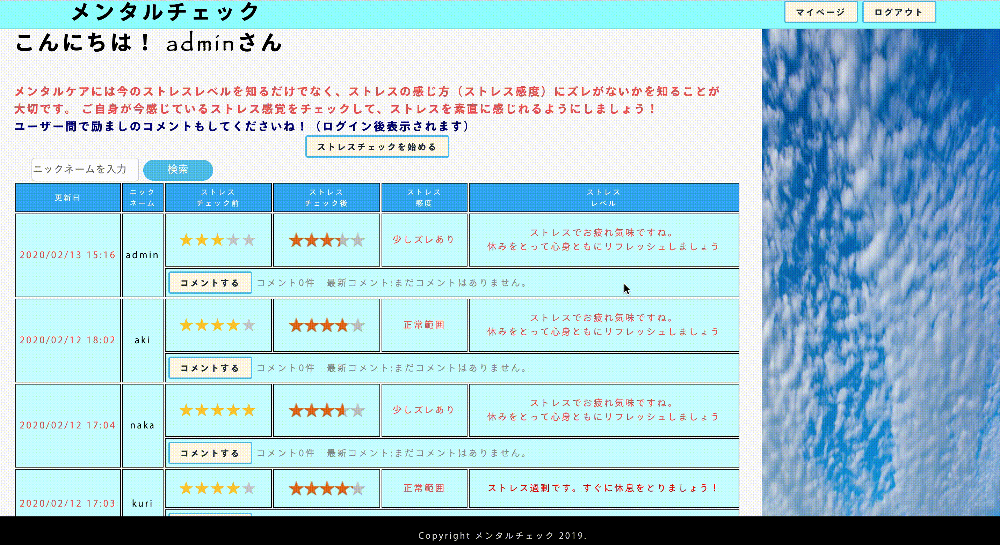

# メンタルチェック

  

## *作成意図* 
ストレスの感じ方にズレが出ていないかのチェックを行い、日常のメンタルケアに役立てる。  
（背景）  
①現状のメンタルチェックはストレス症状がかなり重くなって受けることが多い。  
→もはや手遅れ、症状回復に時間を要する  
②ワーカーホリック(仕事中毒)の場合、チェックを受けても実感が沸かないことが多い。  
→実感との差が客観的にわからない  

ストレスの感じ方の差を客観的に見られれば、自主的にストレスの軽減を意識づけられるのではないかと考え作成。

（特色）  
* チェック結果はレーティングで表示され、チェック前と後との差を視覚化できる。  
* マイページで自身のチェック履歴を参照することで、メンタルの推移を確認できる。  
***

## *開発環境*
    ruby/Ruby on Rails/MySQL/Github/AWS/Visual Studio Code
    ・Rails 5.2.3 
    ・ruby 2.5.1
***    

## *開発期間*
  * 開発期間：3週間
  * 1日あたりの平均作業時間：6〜8時間
 *** 

## *接続先情報*
  * URL http:/3.112.148.165/
  * ログインメールアドレス: admin@123
  * ログインパスワード: admin123
***

## *使用方法*
  ①ログイン  

  ② 「ストレスチェックを始める」ボタンをクリック　　
  ③ー1 チェック前の今の気分を回答する（選択式）　　  
  ③ー2 5つの質問に回答する（選択式）　
  ③ー3　「診断結果」ボタンをクリック  　　
  （未入力項目がある場合はエラーとなり最初から回答し直す）。 　
  ④ ストレス感度と現在のストレスレベルが表示　　
 
 
  ④ （任意）他ユーザーのチェック結果に対し、コメント記入　
   

  ⑤　ニックネームでのユーザー検索　　
 

  ⑥　マイページにて自身のチェック履歴が閲覧（編集、削除も可能）できる  
   
  
 ***
